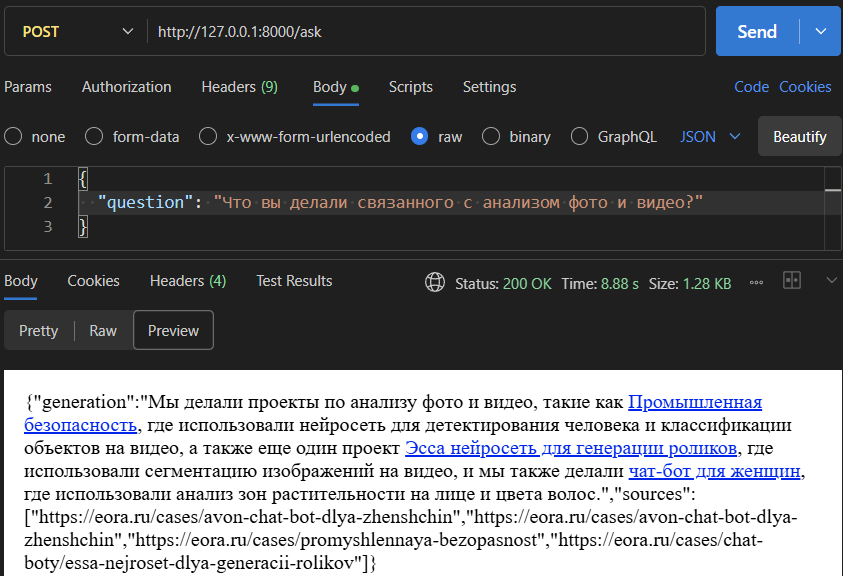

# EORA RAG Project Assistant

Этот проект представляет собой RAG ассистента, который отвечает на вопросы о проектах компании EORA. Он использует информацию, полученную путем парсинга портфолио компании.

## Технологический стек

- **Бэкенд:** FastAPI
- **Оркестрация LLM:** LangChain, LangGraph
- **Векторное хранилище:** ChromaDB
- **Модель эмбеддингов:** `intfloat/multilingual-e5-large`
- **Веб-парсинг:** BeautifulSoup, Aiohttp
- **Контейнеризация:** Docker

### 1. Настройка

**1.1 Клонируйте репозиторий** (если вы этого еще не сделали):
    
```bash
git clone <repository-url>
cd <repository-directory>
```

**1.2 Настройте переменные окружения:**
    Создайте файл `.env` в корневой директории и добавьте в него данные для подключения к LLM:
    
```
LLM_BASE_URL="<URL вашего LLM API>"
LLM_API_KEY="<ключ вашего LLM API>"
LLM_NAME="<имя модели LLM>"
```

### 2. Запуск

**2.1 Ручная установка**

**Создайте и активируйте виртуальное окружение:**
    ```bash
    python -m venv .venv
    source .venv/bin/activate  # Для Linux/macOS
    # или
    .venv\Scripts\activate  # Для Windows
    ```

**Установите зависимости:**

```bash
pip install -r requirements.txt
```

**Запуск API-сервера:**

```bash
uvicorn main:app --reload
```

**2.1 с Docker**

Требования

- Docker
- Docker Compose

Выполните команду:
```bash
docker-compose up --build
```


После запуска сервер будет доступен по адресу `http://localhost:8000`.
Документация Swagger доступна по адресу `http://localhost:8000/docs`.

### 3. Взаимодействие с API

Отправьте POST-запрос на эндпоинт `http://localhost:8000/ask`, чтобы задать вопрос ассистенту, используя следующую JSON структуру:

```json
{
  "question": "Ваш вопрос"
}
```

Сервер вернет ответ ассистента в формате JSON:
```json
{
  "generation": "string",
  "sources": [
    "string"
  ]
}
```

## Примеры работы




- что пробовали сделать 

делал RAG систему, сначала парсил список ссылок, по контенту каждой ссылки формировался Langchain document, а ссылка сохранялась в метадату. По этим документам формируются эмбеддинги и хранятся в ChromaDB. 
В Langgraph берется запрос пользователя, по нему ищется релевантная информация в ChromaDB, всё это прикрепляется к системному промту и отправляется в LLM для генерации ответа.
Использовал FastAPI для передачи запросов и ответов по REST API.

- что сработало, а что не очень

при парсинге сначала информация хранилась в txt, и там было видно, что текст плохо структурировался. В итоге все парсил простов одну строку и при формировании эмбеддингов это делилось на чанки просто по числу символов, что возможно может приводить к не очень точному получению информации с бд при генерции ответов.
- как оценили качество решения

В целом решение выполняет поставленную задачу, на запрос генерируется корректный ответ с примерами и ссылками на источники.
- что бы ещё добавили в решение, если бы было больше времени.

Можно улучшить парсинг документов, чтобы получить более структурированный текст и корректное формирование эмбеддингов, можно поработать над промт-инжинирингом для улучшения генерации, можно добавить хранение истории диалога.
